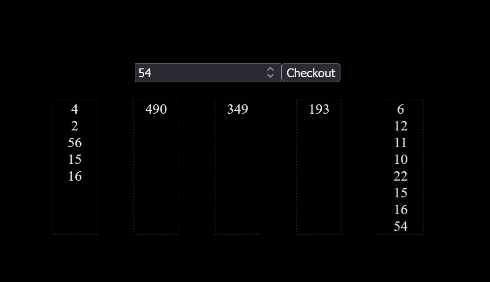

# Checkout Challenge
### The Challenge is to create a checkout simulation with the following criteria:
- 5 aisles/checkouts.
- The checkouts process 1 item every 2 seconds.
- In code, a form is used and on submit the users items (a numeric amount) will be added to the checkout with the least amount of total items.

